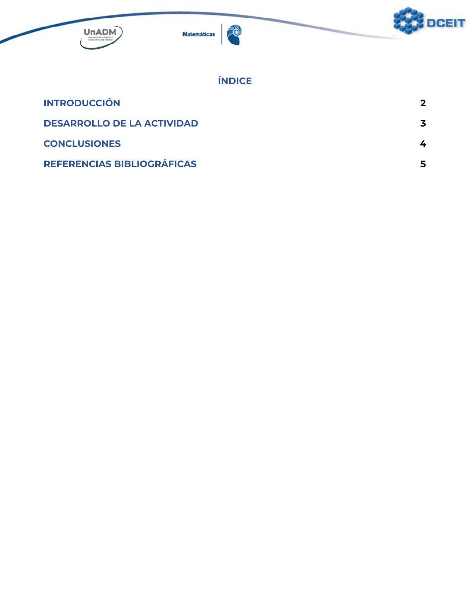
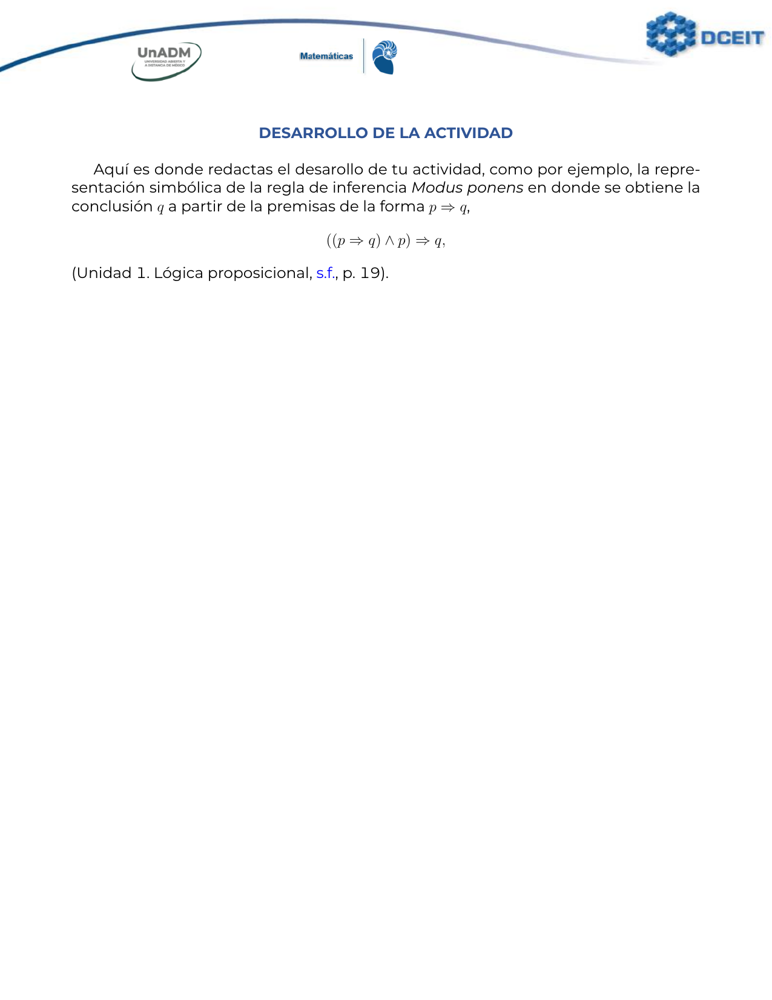
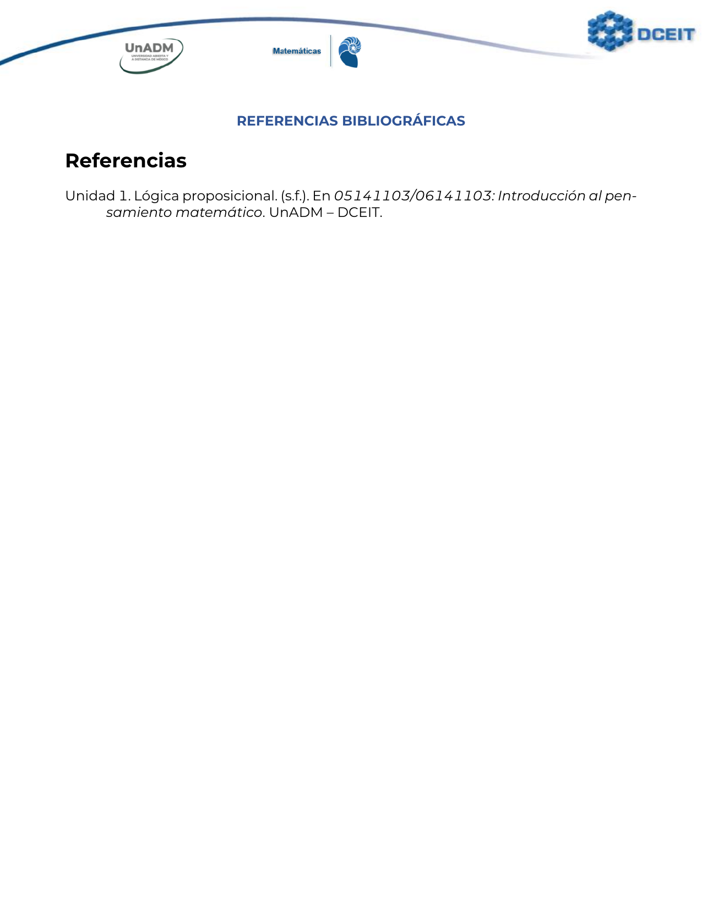

# Otra plantilla para elaborar actividades

Esta es otra plantilla para generar un archivo PDF con las actividades para las unidades didácticas de la [licenciatura en Matemáticas](https://www.unadmexico.mx/division-de-ciencias-exactas-ingenieria-y-tecnologia/matematicas) de la [UnADM](https://unadmexico.mx) utilizando LaTeX. El archivo generado será `actividad.pdf`.

## Motivación

La principal motivación para trabajar con otra plantilla obedece a que la plantilla proporcionada, de manera oficial, utiliza `bibtex` para el manejo de la bibliografía y yo, estoy muy acostumbrado a utilizar el paquete` biblatex` con el cual puedo cambiar de estilo de manejo de la bibliografía cambiando únicamente una línea, de manera que cambiar al estilo de bibliografía APA es bastante simple, el cual es el solicitado para la elaboración de las actividades.

Por otro lado, ya que únicamente requiero de concentrarme (editar) las secciones correspondientes a la introducción, el desarrollo de la actividad, las conclusiones, la bibliografía y los datos de identificación de la misma, con lo que no necesito de saber que comandos son los utilizados para definir el estilo del documento final, de manera que no necesito de navegar por el (único) archivo del que consta la plantilla para editar dichas secciones, he preferido crear archivos independientes para estas, es decir, para redactar la introducción de mi actividad sólo voy a requerir de editar el archivo [`introduccion.tex`](introduccion.tex), así para las demás secciones.

Para el caso de la sección con los datos de identificación de la actividad el proceso es ligeramente más complejo, y esto se debe a que utilizo esta misma información para incluirla en el diccionario de información del PDF generado.

## Similitudes

En esta plantilla se procura mantener el mismo estilo sugerido en el archivo `.docx`, como son el color en los nombres de cada una de las secciones, la fuente (font) del documento, para lo cual se utilizaron a algunas de las instrucciones definidas en la plantilla oficial para `LaTeX`.

## Uso de la plantilla

Para el uso de la plantilla necesitaras de editar cada unos de los archivos que corresponden a cada una de las secciones requeridas para cualquier actividad, es decir, editar con contenido original los archivos [`conclusiones.tex`](conclusiones.tex), [`desarrollo.tex`](desarrollo.tex), [`introduccion.tex`](introduccion.tex) y [`referencias.bib`](referencias.bib).

Además, también necesitaras de editar el archivo [`identificacion.tex`](identificacion.tex) con los datos que se mostraran en la portada, las principales líneas a modificar son:
```
\newcommand{\semestre}{Semestre}
\newcommand{\udidactica}{Nombre de la materia}
\newcommand{\uaprendizaje}{Unidad número}
\newcommand{\actividad}{Número de la actividad y título de la actividad}
\newcommand{\estudiante}{Nombre del estudiante}
\newcommand{\matricula}{Matrícula del estudiante}
\newcommand{\grupo}{Grupo del estudiante}
\newcommand{\facademica}{Nombre de la figura académica}
\newcommand{\ubicacion}{Ubicación}
```
por ejemplo, si la actividad a desarrollar corresponde a _la actividad 2_ de _la unidad 1_ de la materia _Álgebra moderna I_ (la cual corresponde al _séptimo_ semestre), en el grupo _MT-MAMD1-5001-B2-001_, impartida por el _Dr. Y_, y tu nombre es _X_ de la _CDMX_ con matrícula _ES123456789_, entonces el texto modificado se verá como el siguiente:
```
\newcommand{\semestre}{Séptimo}
\newcommand{\udidactica}{Álgebra moderna I}
\newcommand{\uaprendizaje}{Unidad 1}
\newcommand{\actividad}{Actividad 2. Problemas}
\newcommand{\estudiante}{X}
\newcommand{\matricula}{ES123456789}
\newcommand{\grupo}{MT-MAMD1-5001-B2-001}
\newcommand{\facademica}{Dr. Y}
\newcommand{\ubicacion}{CDMX}
```

## Ejecución

La manera en como generas el archivo PDF con tu actividad dependerá de la plataforma que este utilizando. Yo utilizo una distribución de GNU/Linux, para lo cual utilizo una instrucción como la siguiente
```
pdflatex activdad
biber actividad
pdflatex actividad
pdflatex actividad
```
o alguna otra variación, dependiendo de si alguna referencia se ha agregado o cambiado.

Esta plantilla ya se encuentra dentro de las plantillas en [Overleaf.com](https://www.overleaf.com/latex/templates/actividades-para-la-licenciatura-en-matematicas-unadm/xfnjrtnpzsnt).

No se ha podido probar esta plantilla en alguna plataforma. Estoy casi seguro de que si utilizas [MiKTeX](https://miktex.org/), en Windows, no debes de tener problema alguno.

Un posible trabajo futuro podría ser el de definir una clase de documento para las actividades que tenga como variables de configuración los datos de identificación de la actividad.

### Ejemplo

En las siguientes imágenes se muestra un ejemplo de ejecución







